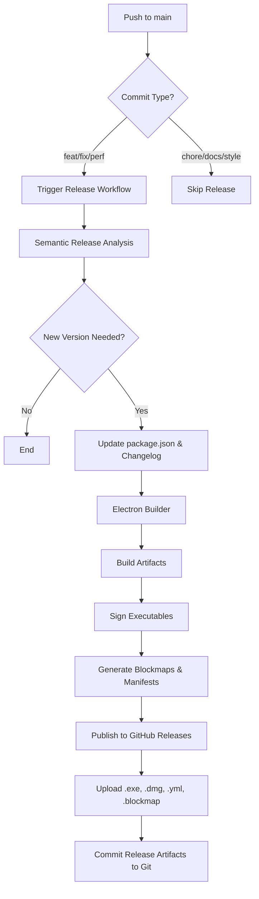
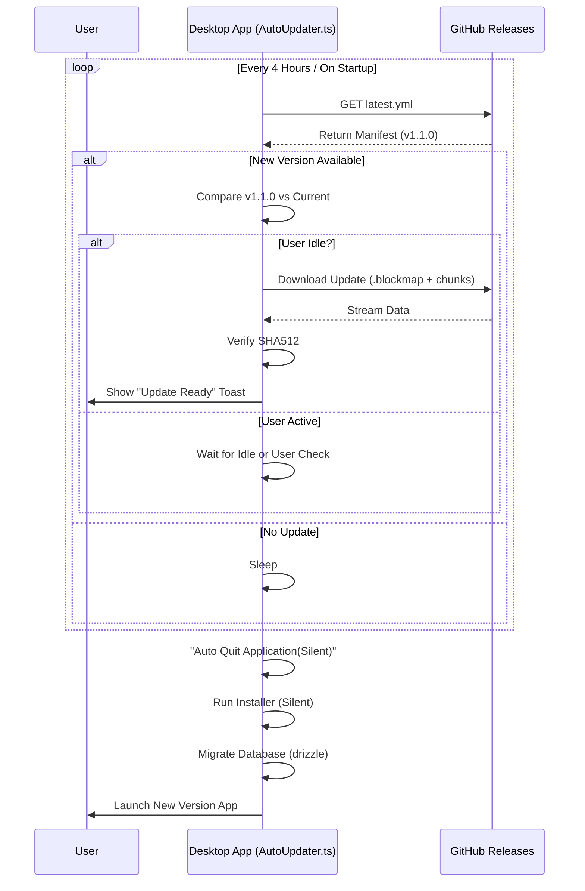

# Release & Auto-Update Workflow

This guide details the complete lifecycle of how changes in the code become available updates for users. It covers the release automation pipeline, versioning logic, and the client-side auto-update mechanism.

## Overview

The `AurSwift` desktop application uses a fully automated CD (Continuous Deployment) pipeline.
- **Trigger**: Pushing to the `main` branch.
- **Automation**: `semantic-release` determines the version bump and generates changelogs.
- **Build**: `electron-builder` compiles the application and signs artifacts.
- **Distribution**: GitHub Releases hosts the binaries and update manifests.
- **Update**: The client application polls GitHub for new versions.

---

## 1. The Release Workflow

The release process is triggered automatically by GitHub Actions when code is pushed to the `main` branch.

### 1.1 Triggering a Release
To trigger a release, a developer must push a commit to `main` with a **Conventional Commit** message. The type of commit determines the type of release.

### 1.2 Release Decision Logic (Semantic Release)

The project uses `@semantic-release/commit-analyzer` to decide the next version number. The rules are configured in `desktop/.releaserc.js`.

| Commit Type | Example Message | Release Type | Version Impact |
| :--- | :--- | :--- | :--- |
| `feat` | `feat: add offline mode` | **Minor** | `1.0.0` → `1.1.0` |
| `fix` | `fix: login crash` | **Patch** | `1.0.1` → `1.0.2` |
| `perf` | `perf: improve startup time` | **Patch** | `1.0.1` → `1.0.2` |
| `refactor` | `refactor: user context` | **Patch** | `1.0.1` → `1.0.2` |
| `build` | `build: update dependencies` | **Patch** | `1.0.1` → `1.0.2` |
| `revert` | `revert: bad commit` | **Patch** | `1.0.1` → `1.0.2` |
| `docs` | `docs: update readme` | **None** | Ignored |
| `style` | `style: format code` | **None** | Ignored |
| `test` | `test: add unit tests` | **None** | Ignored |
| `chore` | `chore: cleanup vars` | **None** | Ignored |
| `ci` | `ci: update workflow` | **None** | Ignored |
| **BREAKING CHANGE**| `feat!: drop support for win7` | **Major** | `1.0.0` → `2.0.0` |

#### Ignored Commits
Any commit message containing `[skip ci]` or `[ci skip]` will typically be ignored by the CI pipeline entirely, preventing a build or release.

### 1.3 Artifact Generation (Electron Builder)

Once a semantic version is determined, `electron-builder` compiles the application.
**Configuration**: `desktop/electron-builder.mjs`

It generates the following critical files:
1.  **Installers**: `aurswift-x.y.z.exe` (Windows NSIS), `.dmg` (macOS).
2.  **Auto-Update Packages**: `aurswift-x.y.z.nupkg` (Windows Squirrel).
3.  **Blockmaps**: `*.blockmap` (Start & end details for differential downloads).
4.  **Manifests**: `latest.yml` (Windows), `latest-mac.yml` (macOS).

### 1.4 Publication (GitHub Releases)

`semantic-release` publishes the release to [AurSwift/AurSwift](https://github.com/AurSwift/AurSwift/releases).

**Assets Uploaded:**
- `dist/*-win-*.exe` (Installer)
- `dist/*.blockmap` (Differential Update Info)
- `dist/squirrel-windows/*.nupkg` (Squirrel Package)
- `dist/squirrel-windows/RELEASES` (Squirrel Manifest)
- `dist/latest*.yml` (Electron Updater Manifest)

**Note:** The system also commits the version bump back to `package.json` and `CHANGELOG.md` with the message:
`chore(release): ${nextRelease.version} [skip ci]`

---

## 2. Client Auto-Update Workflow

The client application (`AutoUpdater.ts`) periodically checks for these published releases.

### 2.1 Update Check Logic
**File**: `packages/main/src/modules/AutoUpdater.ts`

1.  **Polling**: The app checks for updates every 4 hours (configured in code).
2.  **Manifest Retrieval**: It downloads `latest.yml` from the GitHub Release assets.
3.  **Comparison**: It compares the `version` in `latest.yml` with `app.getVersion()`.
4.  **Differential Check**:
    - If a `.blockmap` is available, it compares the file blocks using `electron-updater`.
    - **Efficiency**: Only changed blocks (differential update) are downloaded if possible.
    - **Fallback**: If blocks don't match or file is too different, it downloads the full installer.

### 2.2 Download & Install
1.  **Download**: Happens in the background. Users can "Remind Me Later" (postpone).
2.  **Verification**: Checksum (SHA512) validation ensures integrity.
3.  **Installation**:
    - **NSIS (Windows)**: Runs the installer silently on quit/restart.
    - **Squirrel (Windows)**: Applies the delta update (`.nupkg`).
    - **Mac**: Mounts DMG and swaps bundle.

---

## 3. Workflow Diagrams

### Release Pipeline (GitHub Side)

### Auto-Update Client Flow (User Side)

---

## Key Files Reference

| File | Purpose |
| :--- | :--- |
| `desktop/.releaserc.js` | Configures Semantic Release plugins, commit analysis rules, and release note formatting. |
| `desktop/electron-builder.mjs` | Configures build targets, artifacts, and GitHub publication settings. |
| `packages/main/src/modules/AutoUpdater.ts` | Client-side logic for checking, downloading, and handling updates. |
| `desktop/.github/workflows/release.yml` | (Likely Location) The CI/CD pipeline definition file that orchestrates the build. |
