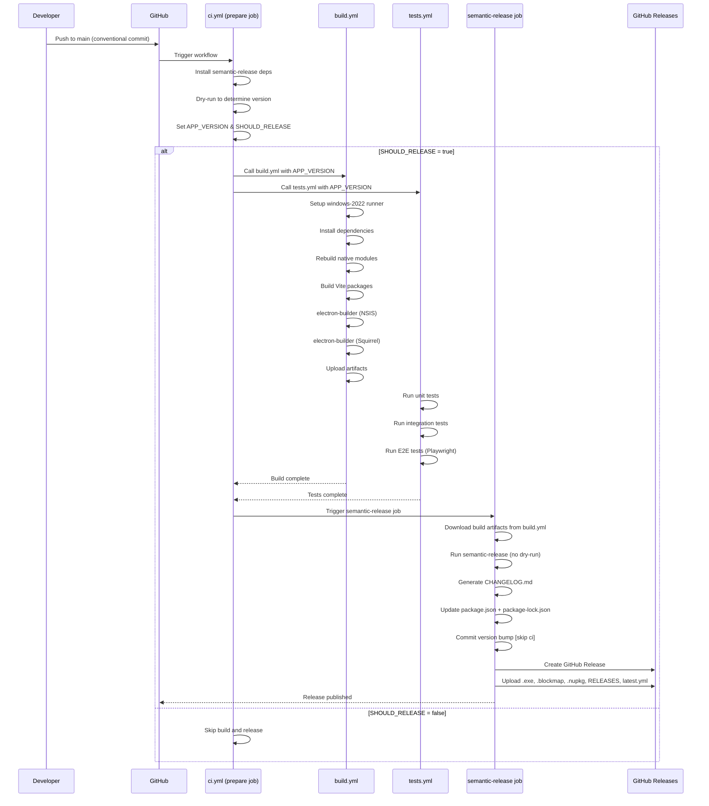
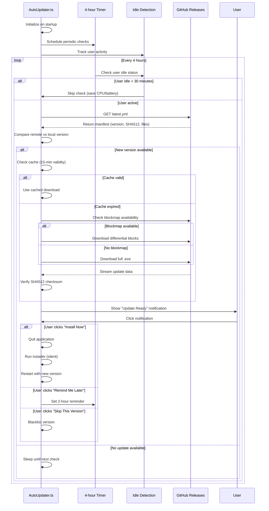

# Release & Auto-Update Workflow

This guide details the complete lifecycle of how changes in the code become available updates for users. It covers the release automation pipeline, versioning logic, and the client-side auto-update mechanism.

## Overview

The `AuraSwift` desktop application uses a fully automated CD (Continuous Deployment) pipeline.
- **Trigger**: Pushing to the `main` branch or workflow dispatch.
- **Automation**: `semantic-release` determines the version bump and generates changelogs.
- **Build**: `electron-builder` compiles the application for Windows (NSIS + Squirrel).
- **Distribution**: GitHub Releases hosts the binaries and update manifests.
- **Update**: The client application polls GitHub for new versions every 4 hours.

---

## 1. The Release Workflow

The release process is triggered automatically by GitHub Actions when code is pushed to the `main` branch or manually via workflow dispatch.

### 1.1 Triggering a Release
To trigger a release, a developer must push a commit to `main` with a **Conventional Commit** message. The type of commit determines the type of release.

### 1.2 Release Decision Logic (Semantic Release)

The project uses `@semantic-release/commit-analyzer` to decide the next version number. The rules are configured in `desktop/.releaserc.js`.

| Commit Type | Example Message | Release Type | Version Impact |
| :--- | :--- | :--- | :--- |
| `feat` | `feat: add offline mode` | **Minor** | `1.0.0` → `1.1.0` |
| `fix` | `fix: login crash` | **Patch** | `1.0.1` → `1.0.2` |
| `perf` | `perf: improve startup time` | **Patch** | `1.0.1` → `1.0.2` |
| `refactor` | `refactor: user context` | **Patch** | `1.0.1` → `1.0.2` |
| `build` | `build: update dependencies` | **Patch** | `1.0.1` → `1.0.2` |
| `revert` | `revert: bad commit` | **Patch** | `1.0.1` → `1.0.2` |
| `docs` | `docs: update readme` | **None** | Ignored |
| `style` | `style: format code` | **None** | Ignored |
| `test` | `test: add unit tests` | **None** | Ignored |
| `chore` | `chore: cleanup vars` | **None** | Ignored |
| `ci` | `ci: update workflow` | **None** | Ignored |
| **BREAKING CHANGE**| `feat!: drop support for win7` | **Major** | `1.0.0` → `2.0.0` |

#### Ignored Commits
Any commit message containing `[skip ci]` or `[ci skip]` will typically be ignored by the CI pipeline entirely, preventing a build or release.

### 1.3 Artifact Generation (Electron Builder)

Once a semantic version is determined, `electron-builder` compiles the application.
**Configuration**: `electron-builder.mjs`

It generates the following critical files:
1.  **Installers**: `aurswift-{version}-win-x64.exe` (Windows NSIS installer).
2.  **Auto-Update Packages**: `aurswift-{version}-win-x64.nupkg` (Windows Squirrel package).
3.  **Blockmaps**: `aurswift-{version}-win-x64.exe.blockmap` (For differential downloads).
4.  **Manifests**: `latest.yml` (Windows auto-updater configuration).
5.  **Squirrel Manifest**: `RELEASES` file (Squirrel update index).

### 1.4 Publication (GitHub Releases)

`semantic-release` publishes the release to [AurSwift/AurSwift](https://github.com/AurSwift/AurSwift/releases).

**Assets Uploaded:**
- `dist/*-win-*.exe` (Windows NSIS Installer)
- `dist/*.blockmap` (NSIS Blockmap for Differential Updates)
- `dist/squirrel-windows/*.nupkg` (Windows Squirrel Package for Auto-update)
- `dist/squirrel-windows/RELEASES` (Squirrel Update Manifest)
- `dist/latest*.yml` (Auto-updater Configuration)

**Repository Updates:**
The system commits version bumps back to the repository:
- `package.json` (updated version)
- `package-lock.json` (updated version)
- `CHANGELOG.md` (generated release notes)

**Commit Message Format:**
```
chore(release): ${nextRelease.version} [skip ci]

${nextRelease.notes}
```

The `[skip ci]` tag prevents triggering another build cycle.

---

## 2. Client Auto-Update Workflow

The client application (`AutoUpdater.ts`) periodically checks for these published releases.

### 2.1 Update Check Logic
**File**: `packages/main/src/modules/AutoUpdater.ts`

**Smart Scheduling Features:**
1.  **Polling Interval**: Checks for updates every 4 hours
2.  **Idle Detection**: Skips checks if user is idle for >30 minutes (saves CPU/battery)
3.  **Startup Delay**: Waits 5 seconds after launch before first check
4.  **Activity Tracking**: Monitors window focus and user interactions

**Update Detection Process:**
1.  **Manifest Retrieval**: Downloads `latest.yml` from GitHub Release assets
2.  **Version Comparison**: Compares remote version with `app.getVersion()`
3.  **Cache Check**: Uses 15-minute cache to avoid redundant downloads
4.  **Differential Check**:
    - If a `.blockmap` is available, `electron-updater` analyzes block changes
    - **Efficiency**: Only changed blocks (differential update) are downloaded
    - **Fallback**: Downloads full installer if differential update not possible

**Error Handling:**
- Request timeout: 10 seconds
- Retry logic: Up to 3 attempts with 2-second delay
- Error notification limit: Maximum 3 notifications per error type

### 2.2 Download & Install
**Download Process:**
1.  **Background Download**: Non-blocking, progress tracked
2.  **Resume Support**: Can resume interrupted downloads using persisted state
3.  **Progress Notifications**: Shows at 50% download progress
4.  **User Controls**: 
    - "Install Now" - Immediate installation
    - "Remind Me Later" - 2-hour postpone (max 3 times)
    - "Skip This Version" - Blacklist specific version

**Verification & Installation:**
1.  **SHA512 Checksum**: Validates integrity before installation
2.  **Installation Methods**:
    - **NSIS (Windows)**: Runs installer silently on quit/restart
    - **Squirrel (Windows)**: Applies delta update from `.nupkg`
3.  **Post-Install**: Automatically restarts with new version
4.  **Database Migration**: Runs Drizzle migrations if schema changed

---

## 3. Key Configuration Details

### Semantic Release Rules (.releaserc.js)

The project uses Angular preset with custom release rules:

| Commit Type | Release Type | Version Impact | Appears in Changelog |
| :--- | :--- | :--- | :--- |
| `feat` | Minor | `1.0.0` → `1.1.0` | ✅ ✨ Features |
| `fix` | Patch | `1.0.1` → `1.0.2` | ✅ 🐛 Bug Fixes |
| `perf` | Patch | `1.0.1` → `1.0.2` | ✅ ⚡ Performance |
| `refactor` | Patch | `1.0.1` → `1.0.2` | ✅ ♻️ Refactoring |
| `build` | Patch | `1.0.1` → `1.0.2` | ✅ 🏗️ Build System |
| `revert` | Patch | `1.0.1` → `1.0.2` | ✅ ⏪ Reverts |
| `docs` | None | No release | ❌ |
| `style` | None | No release | ❌ |
| `test` | None | No release | ❌ |
| `chore` | None | No release | ❌ |
| `ci` | None | No release | ❌ |
| `feat!` or `BREAKING CHANGE` | Major | `1.0.0` → `2.0.0` | ✅ 💥 Breaking Changes |

**Note:** Changelog entries have emojis removed from commit messages for cleaner release notes.

### AutoUpdater Configuration

**Timing & Performance:**
- **Check Interval**: 4 hours (240 minutes)
- **Startup Delay**: 5 seconds
- **Cache Duration**: 15 minutes
- **Idle Threshold**: 30 minutes
- **Activity Check**: Every 5 minutes
- **Request Timeout**: 10 seconds
- **Max Retries**: 3 attempts
- **Retry Delay**: 2 seconds (base)

**User Experience:**
- **Remind Later Interval**: 2 hours
- **Max Postpone Count**: 3 times
- **Max Error Notifications**: 3 per error type
- **Progress Notification**: Shows at 50% download

**Endpoints:**
- **GitHub Repo**: `https://github.com/AurSwift/AurSwift`
- **GitHub Releases**: `https://github.com/AurSwift/AurSwift/releases`
- **Web App Releases**: `https://aurswift.vercel.app/releases`

---

## 4. Files Involved in Release & Update Workflow

### Release Configuration Files

| File | Purpose | Role in Workflow |
| :--- | :--- | :--- |
| `.releaserc.js` | Semantic Release configuration | Defines commit analysis rules, changelog generation, version bump logic, and asset publication |
| `electron-builder.mjs` | Electron Builder configuration | Configures Windows build targets (NSIS + Squirrel), artifact naming, asset exclusions, and publish settings |
| `package.json` | Project manifest | Contains current version, build scripts, and workspace configuration |
| `CHANGELOG.md` | Release history | Auto-generated by semantic-release with emoji-categorized changes |

### GitHub Actions Workflows

| Workflow File | Trigger | Purpose |
| :--- | :--- | :--- |
| `.github/workflows/ci.yml` | Push to `main`, workflow_dispatch, tags | Entry point - orchestrates semantic versioning, build, and release jobs |
| `.github/workflows/build.yml` | Called by ci.yml | Builds Windows artifacts (NSIS + Squirrel) on windows-2022 runner |
| `.github/workflows/tests.yml` | Called by ci.yml | Runs unit, integration, and E2E tests |
| `.github/workflows/codeql.yml` | Push to main, PRs | Security analysis with CodeQL |

### Client-Side Update System

| File | Purpose | Key Features |
| :--- | :--- | :--- |
| `packages/main/src/modules/AutoUpdater.ts` | Auto-update module | • Checks for updates every 4 hours<br>• Smart scheduling (skips idle periods)<br>• Differential downloads via blockmaps<br>• Download progress tracking<br>• User notifications & postpone logic<br>• SHA512 integrity verification |

### Build Artifacts (Generated)

| Artifact | Location | Purpose |
| :--- | :--- | :--- |
| `aurswift-{version}-win-x64.exe` | `dist/` | NSIS installer for clean installs |
| `aurswift-{version}-win-x64.exe.blockmap` | `dist/` | Block-level differential update info |
| `aurswift-{version}-win-x64.nupkg` | `dist/squirrel-windows/` | Squirrel package for delta updates |
| `RELEASES` | `dist/squirrel-windows/` | Squirrel manifest listing all releases |
| `latest.yml` | `dist/` | electron-updater manifest (version, SHA512, files) |

### Release Flow Diagram

```mermaid
flowchart TB
    subgraph "1. Code Changes"
        A[Developer pushes to main] --> B{Commit follows<br/>Conventional Commits?}
        B -->|Yes| C[GitHub Actions Triggered]
        B -->|No| D[Skip Release]
    end
    
    subgraph "2. CI Workflow (.github/workflows/ci.yml)"
        C --> E[Job: prepare]
        E --> F[Install semantic-release]
        F --> G[Dry-run semantic-release]
        G --> H{Version bump needed?}
        H -->|No| I[Skip build & release]
        H -->|Yes| J[Set APP_VERSION output]
        J --> K[Job: build - calls build.yml]
        J --> L[Job: tests - calls tests.yml]
        K --> M[Wait for build completion]
        L --> M
        M --> N[Job: semantic-release]
    end
    
    subgraph "3. Build Workflow (.github/workflows/build.yml)"
        K --> O[Setup windows-2022 runner]
        O --> P[Install Node 22.x + Python]
        P --> Q[Install dependencies]
        Q --> R[Rebuild native modules<br/>better-sqlite3, node-hid,<br/>serialport, usb]
        R --> S[Build renderer + main + preload]
        S --> T[electron-builder --win nsis]
        T --> U[electron-builder --win squirrel]
        U --> V[Generate artifacts in dist/]
        V --> W[Upload artifacts to Actions]
    end
    
    subgraph "4. Semantic Release Job"
        N --> X[Download build artifacts]
        X --> Y[Run semantic-release]
        Y --> Z[Analyze commits per .releaserc.js]
        Z --> AA[Generate CHANGELOG.md]
        AA --> AB[Update package.json version]
        AB --> AC[Commit changes with [skip ci]]
        AC --> AD[Create GitHub Release]
        AD --> AE[Upload assets:<br/>• .exe installer<br/>• .blockmap<br/>• .nupkg<br/>• RELEASES<br/>• latest.yml]
    end
    
    subgraph "5. Client Auto-Update (AutoUpdater.ts)"
        AE --> AF[GitHub Release Published]
        AF --> AG[Client checks every 4 hours]
        AG --> AH[Download latest.yml]
        AH --> AI{New version?}
        AI -->|No| AJ[Sleep until next check]
        AI -->|Yes| AK[Compare with blockmap]
        AK --> AL{Differential<br/>update possible?}
        AL -->|Yes| AM[Download changed blocks only]
        AL -->|No| AN[Download full installer]
        AM --> AO[Verify SHA512 checksum]
        AN --> AO
        AO --> AP[Show 'Update Ready' notification]
        AP --> AQ{User action}
        AQ -->|Install Now| AR[Quit & run installer]
        AQ -->|Remind Later| AS[Postpone 2 hours]
        AS --> AG
        AR --> AT[Silent install & restart]
    end
    
    style A fill:#e1f5ff
    style C fill:#fff4e1
    style K fill:#ffe1f5
    style N fill:#e1ffe1
    style AF fill:#f5e1ff
    style AR fill:#ffe1e1
```

### CI/CD Job Sequence



### Update Check Flow (Client-Side)


