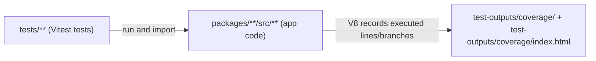

# Coverage & Coverage-Based Testing Study Guide

> **Goal**: Help you deeply understand what coverage is, how it’s configured in this repo, how to read the reports, and how to use it to write better tests.

---

## 1. Big Picture: Tests vs Coverage

- **Tests** are code you write in the `tests/` folder to exercise your app.
- **Coverage** answers:  
  **“When I run all these tests, which parts of my _app code_ actually executed at least once?”**

In this repo:

- **Tests live under** `tests/**` (unit, components, integration, e2e).
- **Coverage is measured over** app/production code under `packages/**/src/**`.
- **Coverage configuration lives in** `vitest.config.ts`.
- **Coverage reports are written to** the `test-outputs/coverage/` folder, especially `test-outputs/coverage/index.html`.

Coverage is a **signal**, not a guarantee:

- High coverage ⇒ a lot of your app code is _executed_ by tests.
- Low coverage ⇒ large parts of your app code are _never touched_ by tests.
- 100% coverage still does **not** guarantee “no bugs”; it only guarantees that every part of the code was _run_ at least once during tests.

---

## 2. Core Coverage Concepts (Theory)

### 2.1 What “coverage” means

Formally, **code coverage** is:

> **The percentage of a defined set of code (e.g., app source files) that gets executed at least once while the test suite runs.**

There are several dimensions:

- **Line / statement coverage**
  - Measures **which lines or statements executed at least once**.
  - Example:
    - 80 covered, 100 total ⇒ line/statement coverage = 80%.

- **Branch coverage**
  - Measures **which branches of control structures** (like `if/else`, `switch`, `?:`, `&&`, `||`) executed.
  - Example:
    - `if (x > 0) { ... } else { ... }`
      - If tests only ever set `x > 0`, the `else` branch is _never_ executed.
      - Line coverage might look “fine” (lines inside `if` are covered), but **branch coverage reveals the missing path**.

- **Function coverage**
  - Measures **how many functions were ever called by tests**.

Most coverage tools show all of these at once, and that’s what Vitest does for this repo.

### 2.2 What coverage is _not_

Coverage **does not** tell you:

- Whether your assertions are good.
- Whether you covered all edge cases.
- Whether your tests reflect real-world usage.

Coverage _only_ tells you **“this code ran”** vs **“this code did not run”** when the tests executed.

### 2.3 Why 100% coverage is not always the goal

Chasing 100% coverage can:

- Encourage **fragile tests** that overfit implementation details.
- Waste time on **low-value code paths** (logging, trivial getters/setters).

Healthier approach:

- Aim for **higher coverage on critical business logic** (payments, transactions, sensitive flows).
- Use **coverage gaps** as hints about where to add tests, rather than as a hard rule to satisfy.

---

## 3. Testing Architecture in This Repo (Quick Recap)

For detailed testing docs, see `[docs/Guides/Testing/Testing/README.md](docs/Guides/Testing/Testing/README.md)` and `[tests/README.md](tests/README.md)`. In short:

- **Test runner**: `Vitest`
  - Handles **unit**, **component**, and **integration** tests.
  - Uses the `jsdom` environment to simulate a browser-like DOM for React components.
- **Global setup**: `tests/setup.ts`
  - JSDOM polyfills.
  - Electron API mocks.
  - Cleanup and MSW setup (for network mocking).
- **E2E tests**: `Playwright`
  - Runs under `tests/e2e`.
  - Uses Playwright’s `_electron` API to control the Electron app.

Where everything runs:

- **Unit / component / integration**: Node.js + JSDOM.
- **E2E**: Real Electron renderer window controlled via Playwright.

> **Important**: Only **Vitest** tests (unit/component/integration) contribute to the **Vitest coverage report** in `test-outputs/coverage/`. Playwright E2E tests have their own reporting under `test-outputs/e2e/`, not `test-outputs/coverage/`.

---

## 4. How Coverage Is Configured in This Repo

All coverage behavior is defined in `[vitest.config.ts](vitest.config.ts)` under the `test.coverage` block:

```ts
coverage: {
  provider: "v8",
  reporter: ["text", "json", "html", "lcov"],
  // In CI we only want to measure code that is actually executed by tests.
  // Counting the entire monorepo (configs/scripts/build tooling) makes the
  // global % extremely noisy and causes threshold flakiness.
  all: false,
  include: ["packages/**/src/**/*.{js,mjs,cjs,ts,mts,cts,jsx,tsx}"],
  exclude: [
    "node_modules/",
    "tests/",
    "**/*.d.ts",
    "**/*.config.*",
    "**/dist/",
    "**/build/",
    "**/*.spec.ts",
    "**/migrations/",
    "**/seed.ts",
  ],
  thresholds: {
    lines: 2,
    functions: 8,
    branches: 27,
    statements: 2,
  },
}
```

Let’s unpack this.

### 4.1 Provider and reporters

- **Provider: `v8`**  
  Uses the JavaScript engine’s built-in coverage mechanism (fast and accurate for TS/JS compiled by Vite).

- **Reporters**:
  - `text`: Summary printed in the terminal.
  - `json`: Machine-readable report in `test-outputs/coverage/`.
  - `html`: **Main human-friendly report** at `test-outputs/coverage/index.html`.
  - `lcov`: `test-outputs/coverage/lcov.info` for external tools (CI dashboards, Sonar, etc.).

### 4.2 What code is measured: `include`

```ts
include: ["packages/**/src/**/*.{js,mjs,cjs,ts,mts,cts,jsx,tsx}"],
```

This says:

- **“Measure coverage only for app/production code under `packages/**/src/**`.”**
- This includes:
  - Main process code (`packages/main/src/**`).
  - Renderer (React) code (`packages/renderer/src/**`).
  - Any other packages’ `src` directories.

Any file that matches this glob **can** be included in coverage **if it is executed during tests**.

### 4.3 What is _not_ measured: `exclude`

```ts
exclude: [
  "node_modules/",
  "tests/",
  "**/*.d.ts",
  "**/*.config.*",
  "**/dist/",
  "**/build/",
  "**/*.spec.ts",
  "**/migrations/",
  "**/seed.ts",
],
```

These are intentionally **removed from coverage calculations**.

**Why exclude `tests/`?**

- Files in `tests/**` are **test drivers**, not app behavior.
- If you included them:
  - Running the tests themselves would “cover” nearly 100% of `tests/**`.
  - Your coverage percentage would be artificially high and wouldn’t tell you anything about **how much app code is actually tested**.
- We want coverage to answer:  
  **“How much of `packages/**/src/**` is exercised by tests?”**,  
  not **“did we execute our test files?”** (we always do).

**Why exclude `node_modules/`?**

- Third-party libraries are not maintained by you.
- They add thousands of lines and would completely distort the coverage percentage.

**Why exclude `dist/` / `build/`?**

- These are **compiled bundles** of your `src` code.
- Including them would double-count the same logic (once in `src`, once in `dist`).

**Why exclude configs, migrations, seeds, etc.?**

- These are mostly **tooling and environment setup**, not core app runtime behavior.
- They tend to be harder to unit-test meaningfully and can introduce noise:
  - Small changes in a config file shift global coverage numbers.
  - That makes the coverage gate “flaky” for no real quality benefit.

### 4.4 `all: false` – what it actually does

```ts
all: false,
```

This means:

- **Only files that are actually executed by tests are counted in coverage.**
- If an included file is **never imported or run** during tests:
  - It won’t appear in the coverage report at all.

This keeps numbers **focused on what’s truly under test** instead of dragging down coverage for code that is completely untouched by the test suite.

### 4.5 Thresholds (CI gates)

```ts
thresholds: {
  lines: 2,
  functions: 8,
  branches: 27,
  statements: 2,
},
```

These are **minimum gates**, not target goals:

- If overall coverage (across measured files) drops **below** any of these values, the coverage step fails in CI.
- In this repo they are deliberately low right now (to unblock CI) and should be increased over time as coverage improves.

---

## 5. How to Run Tests and Coverage

Key commands (see also `[tests/README.md](tests/README.md)` and `[docs/Guides/Testing/Testing/README.md](docs/Guides/Testing/Testing/README.md)`):

```bash
# Run all Vitest tests (default)
npm run test

# Run with coverage (text summary in terminal + test-outputs/coverage/ folder)
npm run test:coverage

# Run with coverage and open HTML report (test-outputs/coverage/index.html)
npm run test:coverage:html

# E2E (does NOT feed into Vitest coverage)
npm run test:e2e
```

Flow when you run `npm run test:coverage`:

1. Vitest finds matching test files under `tests/**` (excluding `tests/e2e` and `*.spec.ts`).
2. `tests/setup.ts` runs (jsdom, Electron mocks, MSW, cleanup wiring).
3. Tests execute and V8 records which parts of `packages/**/src/**` were run.
4. Vitest writes detailed coverage data into `test-outputs/coverage/`:
   - `test-outputs/coverage/index.html` – main report.
   - `test-outputs/coverage/lcov.info` – LCOV data.
   - `test-outputs/coverage/*.json` – JSON data.

---

## 6. How to Read `test-outputs/coverage/index.html`

When you open `test-outputs/coverage/index.html`, you get a **visual dashboard** of which files are covered.

### 6.1 Top-level view (table of files)

You’ll see columns like:

- **File** – path of each measured file (e.g. `packages/renderer/src/.../MyComponent.tsx`).
- **Statements / Branches / Functions / Lines** – each shows:
  - `X% (Y/Z)` where:
    - `X%` = percentage covered.
    - `Y` = number of items covered.
    - `Z` = total number of items.

Coloring (exact colors depend on theme, but conceptually):

- **Green** – good/high coverage (meets or exceeds thresholds).
- **Yellow/Orange** – medium coverage (some gaps).
- **Red** – low coverage (large untested areas).

You can:

- **Click a directory** to drill into subfolders.
- **Click a file name** to see line-by-line coverage for that file.

### 6.2 Inside a single file view

When you click on a file:

- The header shows coverage for **just that file**.
- The code area is annotated:
  - **Covered lines** – usually greenish highlighting or checkmarks.
  - **Uncovered lines** – red or highlighted as “not executed”.
  - **Partially covered branches** – often yellow on conditional expressions where some branches ran, others didn’t.

Typical patterns you’ll see:

- Only the `if` branch is covered, `else` is red.
- Only one case of a `switch` is ever hit.
- A function is defined but never called (line/function uncovered).

### 6.3 What to do with this information

Use coverage like a **map of untested behavior**:

1. Sort or visually scan for **red/yellow files or rows**.
2. Open those files.
3. For each red line/branch, ask:  
   **“What scenario in real app usage would exercise this line?”**
4. Add or adjust tests to create exactly that scenario.
5. Re-run `npm run test:coverage` and confirm that lines/branches turn green.

---

## 7. What Coverage Is Measured _Over_ in This Repo

This was a core source of confusion, so let’s state it clearly.

- Coverage is **NOT** measured over your test files.
- Coverage **IS** measured over your **app code** in `packages/**/src/**`.
- Tests under `tests/**` are **drivers**: they cause app code to execute.

Conceptual flow:



So when you write a test like `tests/components/MyComponent.test.tsx`:

- The test imports `MyComponent` from something like `packages/renderer/src/components/MyComponent.tsx`.
- Running that test executes part of `MyComponent.tsx`.
- Coverage marks those executed lines and branches as **covered** in the report.

---

## 8. Why Certain Paths Are Included vs Excluded

To summarize the “why” behind the config decisions in `vitest.config.ts`:

- **Included (`packages/**/src/**`)**:
  - This is the **real app code** that ships to users.
  - We want coverage to represent our confidence in this behavior.

- **Excluded (`tests/**`, `node_modules/`, `dist/`, `build/`, configs, migrations, seeds)\*\*:
  - **Tests** – we care about _what they exercise_, not about “coverage of the tests”.
  - **Vendor code (`node_modules/`)** – not yours; would dominate the coverage denominator.
  - **Generated output (`dist/`, `build/`)** – duplicate of `src` logic.
  - **Tooling (`*.config.*`, migrations, seeds)** – infrastructure code where coverage is noisy and often not worth gating.

**Rule of thumb for any project**:

- **Include**: Things that implement user-facing or business-critical behavior.
- **Exclude**: Test harnesses, vendor code, generated code, and infra tooling that would distort the metric.

---

## 9. Q&A – Your Original Questions, Answered

This section mirrors the questions you asked while learning coverage, with concise answers.

### Q1. “What does coverage mean?”

**Answer**:  
Coverage is the **percentage of your defined source code** (here, `packages/**/src/**`) that gets executed at least once when you run your automated tests. It’s about **code execution**, not about how many tests you have.

---

### Q2. “Is coverage specific to tests type file or other type of files also like `.tsx`?”

**Answer**:  
Coverage is **measured over your app/source files** (including `.tsx` React components), not over test files.  
In this repo:

- Vitest runs test files in `tests/**`.
- While those tests run, they import and execute app code under `packages/**/src/**`.
- Coverage tells you **how much of that app code** (TS/TSX/etc.) was executed.

Test files themselves are **excluded** from coverage via `coverage.exclude`.

---

### Q3. “I see in `vitest.config.ts` that `tests/` is excluded from coverage. Why?”

**Answer**:  
Because we want coverage to reflect **how well tests exercise the app**, not how much of the test code itself runs.

- If `tests/**` were included, nearly 100% of test lines would be “covered” (tests always run themselves).
- That would inflate the coverage number and hide the real question:  
  **“How much of `packages/**/src/**` did we actually test?”**

So `tests/` is excluded to keep the metric **honest and meaningful**.

---

### Q4. “Why are some `src` folders included and others excluded? How do we decide what to include/exclude?”

**Answer**:  
We include `packages/**/src/**` because that’s the **core application code** (main, renderer, shared libs).  
We exclude:

- `node_modules/` – third-party dependencies.
- `dist/`, `build/` – build outputs.
- `**/*.config.*`, `migrations`, `seed.ts` – infra/tooling code.

The decision rule is:

- **Include** code that represents **business behavior or user-facing logic**.
- **Exclude** code that is **third-party, generated, or purely operational tooling**, where coverage would be noisy or not actionable.

---

### Q5. “Does `coverage` in `vitest.config.ts` mean ‘how much tests code has been defined’?”

**Answer**:  
No. The `coverage` block in `vitest.config.ts` configures **how Vitest measures and reports which _source code_ was executed by tests**.

It controls:

- Which files are **measured** (`include` / `exclude`).
- Which **report formats** are produced (`text`, `html`, `json`, `lcov`).
- Whether to consider all files or only executed ones (`all`).
- **Minimum thresholds** that CI enforces (`thresholds`).

It does _not_ count “how many tests” you wrote; it counts **how much of your app code those tests executed**.

---

### Q6. “How do I read `test-outputs/coverage/index.html`?”

**Answer** (short version; see section 6 for full detail):

1. Open `test-outputs/coverage/index.html`.
2. Look at the top table:
   - Columns: `File`, `Statements`, `Branches`, `Functions`, `Lines`.
   - Values like `X% (Y/Z)` show how much of each category is covered.
3. Click a file to view line-by-line coverage:
   - Green = executed.
   - Red = never executed.
   - Yellow (on conditionals) = some branches covered, some not.
4. Use uncovered lines/branches to decide what scenarios or inputs your tests are currently missing, then write new tests to cover them.

---

## 10. How to Practice Using Coverage Effectively

Here’s a small, practical exercise you can repeat as you learn.

### 10.1 Exercise: Improve coverage for one file

1. Run:
   ```bash
   npm run test:coverage:html
   ```
2. Open `test-outputs/coverage/index.html` and look for:
   - A file under `packages/**/src/**` that has **low or medium coverage** (yellow/red).
3. Click into that file and:
   - Note which **functions** or **branches** are uncovered.
4. Open the corresponding test directories:
   - `tests/unit/**`, `tests/components/**`, or `tests/integration/**`.
5. Write or extend a test that:
   - Calls the uncovered function with different input.
   - Exercises the missing branch (`if` vs `else`, error path, edge case, etc.).
6. Run coverage again:
   ```bash
   npm run test:coverage
   ```
7. Confirm that:
   - The relevant lines/branches turned green.
   - The file’s coverage percentages improved.

### 10.2 Good habits with coverage

- Use coverage to **find blind spots**, not to “game the number”.
- Focus first on:
  - Payment/transaction logic.
  - Critical services (printing, integrations).
  - Complex components with lots of conditionals.
- Combine coverage with:
  - **Domain knowledge** (what’s risky/expensive to fail).
  - **Bug history** (what has broken before).

If you keep iterating like this—pick a file, inspect coverage, write a test, repeat—you’ll gradually build a **high-confidence, well-tested codebase** without getting lost in abstract numbers.
